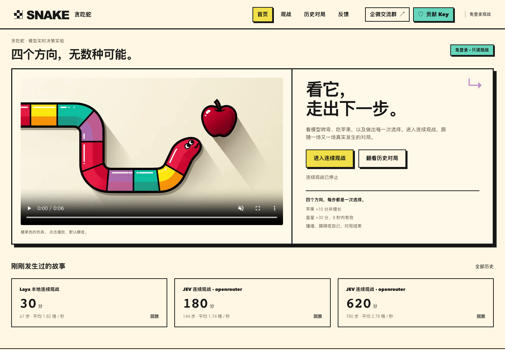
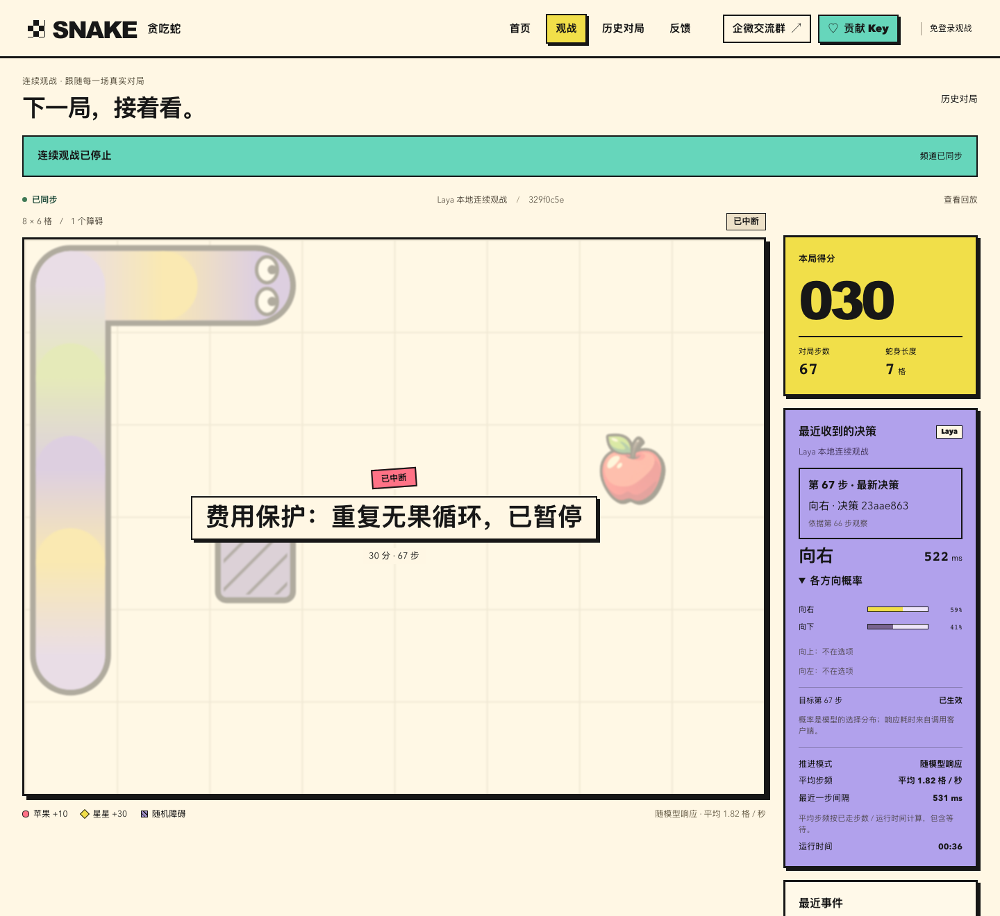
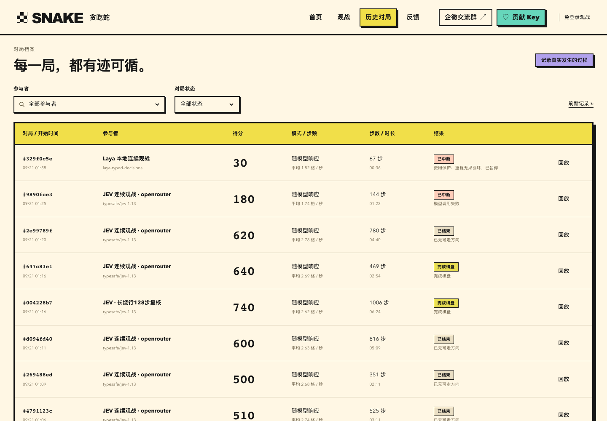
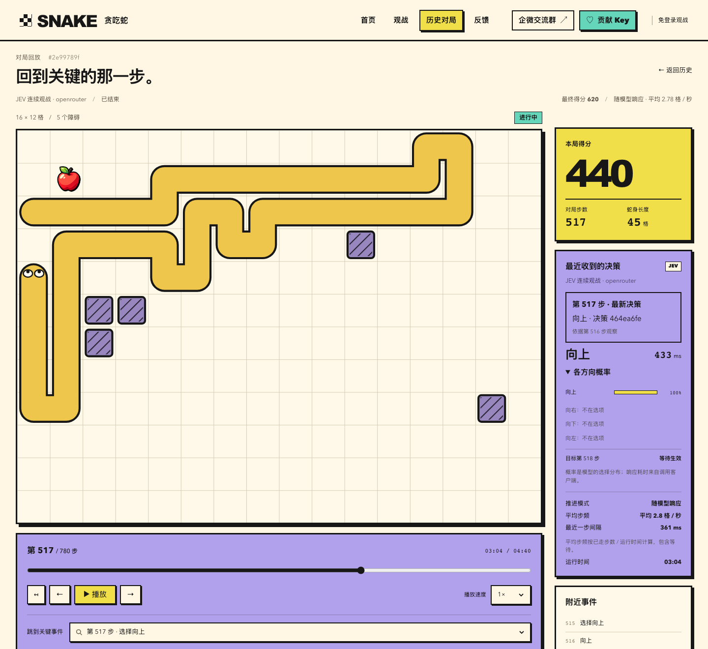
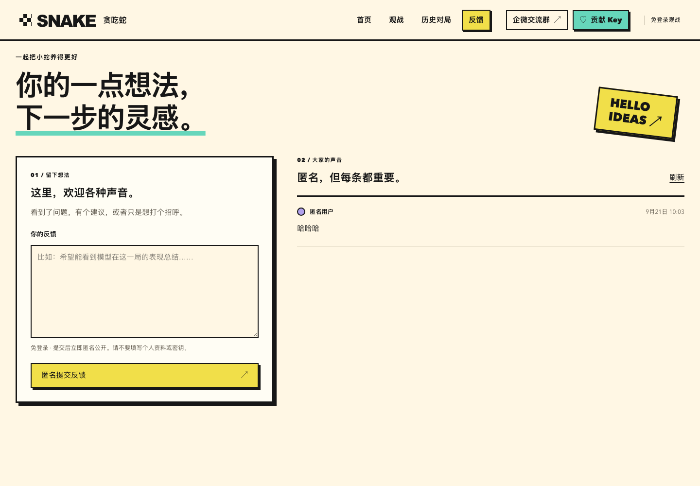
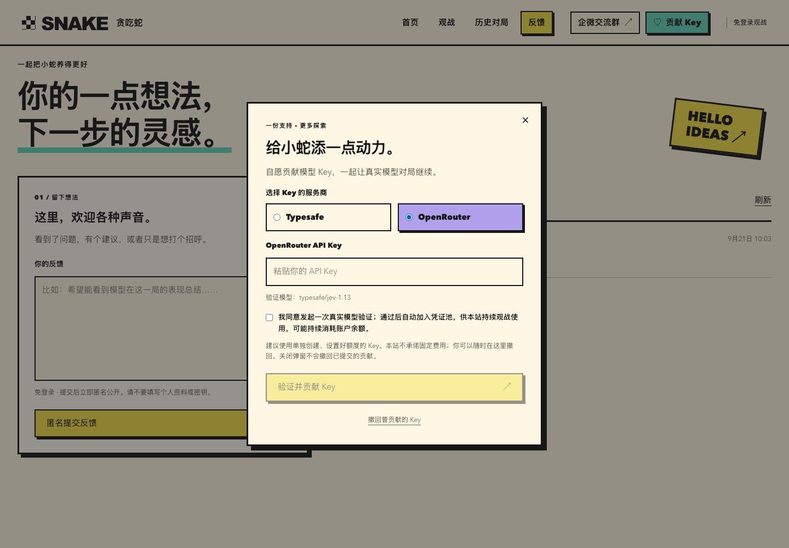

# SNAKE · JEV 实时贪吃蛇

看模型走出下一步。

JEV 通过 Typesafe 或 OpenRouter 选择方向，服务端推进真实棋盘：每次有效模型响应只走一步，等待时蛇保持原位。游客可以免登录观战、查看历史回放、提交匿名反馈，也可以自愿贡献模型 Key。

## 界面预览

| 首页 | 连续观战 |
| --- | --- |
| [](docs/screenshots/home.png) | [](docs/screenshots/watch.png) |

| 历史对局 | 对局回放 |
| --- | --- |
| [](docs/screenshots/history.png) | [](docs/screenshots/replay.png) |

| 匿名反馈 | 贡献模型 Key |
| --- | --- |
| [](docs/screenshots/feedback.png) | [](docs/screenshots/contribute-key.png) |

截图采集于 2026-09-22，均来自实际页面。观战图为频道停止时保留的上一局；回放图为已有真实对局的第 517 步。点击图片可查看原尺寸。

## 现在可以做什么

- **连续观战**：在固定入口跟随一场又一场对局，查看得分、模型选择、原始概率和真实耗时。
- **历史与回放**：按参与者、状态筛选，逐步回看、调整播放速度、跳转关键事件，并查看当时发送的模型请求。
- **匿名反馈**：免登录提交，保存后立即匿名公开，管理员可隐藏或恢复展示。
- **Key 贡献**：支持 Typesafe / OpenRouter，真实验证通过后加密保存；启用凭证池后按同服务商规则参与连续观战，贡献者可撤回。
- **社区交流**：顶栏提供企微入群链接或二维码入口，由站点配置。

游戏由模型控制，游客不操作蛇或接管对局。地图、移动、得分和回放来自服务端持久记录。

## 本地启动

需要 **Bun 1.4.2**，版本记录在 [`.bun-version`](.bun-version)，依赖由 `bun.lock` 锁定。

```sh
bun install --frozen-lockfile
# 首次创建配置；已有 .env 时保留原文件
[ -f .env ] || cp .env.example .env
```

在 `.env` 中填写以下配置，完整示例见 [`.env.example`](.env.example)：

| 配置 | 用途 |
| --- | --- |
| `GAME_ADMIN_TOKEN` | 管理员口令，至少 32 个字符；可用 `openssl rand -hex 32` 生成 |
| `SQLITE_PATH` | 数据库路径，示例为 `.data/snake.sqlite` |
| `TYPESAFE_API_KEY` | 使用默认 Typesafe 服务商时填写 |
| `JEV_PROVIDER=openrouter` + `OPENROUTER_API_KEY` | 使用 OpenRouter 时显式选择并填写其 Key |

```sh
bun run build
bun run serve
```

打开 [http://localhost:3000](http://localhost:3000)。网页默认运行在 3000，游戏服务在 3001；`serve` 使用构建产物，保存源码不会刷新页面或重启对局。开发时使用 `bun run dev`，两种方式不要同时占用相同端口。

### 开始连续观战

打开 [http://localhost:3000/watch?admin=1](http://localhost:3000/watch?admin=1)，输入管理员口令，点击“开启连续观战”。这会开始真实模型调用并产生服务商费用。访问普通页面不会自动开局。

- **停止连续开局**：让本局继续到结束，之后不再开局。
- **立即停止本局**：中断本局并取消后续开局。
- 关闭网页或注销管理不会停止已开启的频道。

服务重启会按保存状态恢复未完成响应局；已停止或故障的频道保持原状态。详细恢复与费用保护规则见 [运行与部署](docs/running.md)。

### 开放 Key 贡献和交流群

在 `.env` 中启用贡献入口及凭证池，并设置独立加密主密钥：

```dotenv
JEV_CONTRIBUTIONS_ENABLED=true
JEV_CREDENTIAL_POOL=true
CREDENTIALS_MASTER_KEY=<32字节随机值的base64编码>
```

主密钥可用 `openssl rand -base64 32` 生成，需安全保管且不能随意替换。重启服务后配置生效。

用户确认授权后，系统实际调用对应模型验证；验证和入库都成功才展示感谢动效。Key 不在公开页面、回放或日志中展示，管理员仅能查看脱敏状态。验证和后续使用都会消耗贡献者账户余额。

企微入口使用 `COMMUNITY_WECOM_JOIN_URL` 或 `COMMUNITY_WECOM_QR_URL`，未配置时明确显示未配置状态。生产环境使用 HTTPS；权限、撤回、错误处理及全部配置见 [运行与部署](docs/running.md)。

## 页面入口

| 路径 | 功能 |
| --- | --- |
| `/` | 首页、规则与最近对局 |
| `/watch` | 跟随连续观战频道 |
| `/watch/:matchId` | 固定查看一场对局 |
| `/matches` | 历史列表与筛选 |
| `/matches/:matchId/replay` | 回放与原始模型输入 |
| `/feedback` | 匿名反馈 |
| `/watch?admin=1` | 管理员解锁、频道控制与社区管理 |

## 开发

技术栈：TypeScript、SolidJS、TanStack Solid Start/Router、Vite、Hono、WebSocket、SQLite（better-sqlite3）。

| 命令 | 用途 |
| --- | --- |
| `bun run dev` | 同时启动前后端开发服务 |
| `bun run dev:web` / `bun run dev:server` | 单独启动前端 / 后端 |
| `bun run test` | 运行 Vitest 测试；指定文件可追加 `tests/game.test.ts` |
| `bun run typecheck` | 检查前后端 TypeScript |
| `bun run check` | 格式与 lint 检查 |
| `bun run generate-routes` | 重新生成路由树 |
| `bun run build` | 构建前后端 |
| `bun run jev` | 在已启动服务上运行一场真实模型对局 |

测试使用临时 SQLite、WebSocket 和明确的测试传输；真实模型评估单独执行和报告。密钥、数据库及本地 `.data/` 产物不提交。

## 部署

构建后分别运行 `bun run start:server` 和 `bun run start`。生产需要两个常驻服务、持久磁盘，以及 `/api`、`/ws` 反向代理；SQLite 后端不能仅靠前端静态托管运行。

当前数据库 schema 为 v3，升级前应做一致性备份。部署配置、会话 Origin、数据迁移与回滚步骤见 [运行与部署](docs/running.md#部署与数据维护)。

## 更多文档

- [运行与部署](docs/running.md)：配置、频道控制、Key 贡献、CLI、数据维护与 API。
- [当前模型输入](docs/jev-compact-growth.md)：V16 的精简请求。
- [增长与后续空间分析](docs/jev-growth-space.md)：当前分析事实及其边界。
- [历史模型实验](docs/jev-experiments.md)：旧版上下文、评估命令和验收索引。
- [OpenSpec 规格](openspec/specs/) 与 [变更记录](openspec/changes/)。
- [协作约定](AGENTS.md)。

奖励图片使用 ImageGen 生成素材；片头与胜利视频由用户提供的 Seedance 素材制作。
