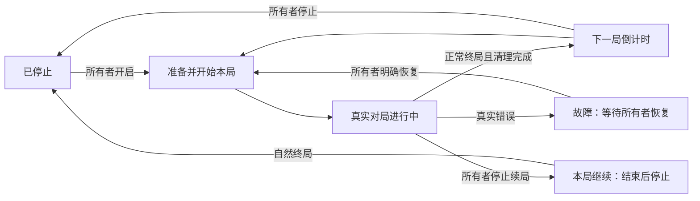

## Context

动机见 [proposal.md](proposal.md)。本设计以当前工作区为基线，不以 Git HEAD 的模板代码代替未提交实现。

| 当前文件 | 已观察到的行为及本次接入位置 |
| --- | --- |
| `src/routes/index.tsx` | `/` 直接渲染 `LivePage`，介绍区仅在没有选中局时出现 |
| `src/routes/watch.$matchId.tsx` | 同一 `LivePage` 绑定具体 matchId；必须保留此链接含义 |
| `src/features/snake/LivePage.tsx` | 同时负责目录、选局、HTTP 快照、单局 WS 续读、空态介绍、最近历史和实时布局 |
| `src/components/Header.tsx` | 当前只有“观战 / 历史对局”，观战指向 `/` |
| `scripts/run-jev.ts` | 带顶层副作用的单局 CLI：创建、WS start、逐次决策、错误/退出清理，尚无可供服务端调用的运行接口 |
| `server/matches/service.ts` | 权威局面、模式/目标校验、事件提交、进度事实；初始化中断原 running 局，不处理 ready 局 |
| `server/db/store.ts` | SQLite schema v1，仅有 matches、match_events、control_requests，创建与事件使用同步事务 |
| `server/app.ts` | 公开 HTTP/WS 读取，创建要求管理员 Bearer，单局控制要求独立 token；没有浏览器管理员会话 |
| `server/index.ts` / `start.ts` | 一个常驻游戏服务；关闭时清理对局和连接，目前关闭命令硬编码协议 1，接线时须兼容两步局 |
| `tests/jev-runner.test.ts` / `ws.test.ts` | 已有真实 HTTP/WS/SQLite 与外部传输边界替身，可沿用来验证管理层，不伪造真实模型成绩 |
| `package.json` | 当前检查工具为 Oxfmt/Oxlint，已不使用先前会话的 Biome |

用户已确认：手动开启一次后连续运行；停止时让已运行本局结束；管理入口由额外页面参数显示并以口令解锁。截图对应现有 `empty-copy` 介绍结构。主规格尚未汇总，修改条款取自现有 change 中的同名能力，后续归档须先处理旧基线。

## Goals / Non-Goals

**Goals:**
- 页面职责分离，频道调度不依赖任何一个浏览器或观看人数。
- 保留所有者意图，准确处理停止/开局竞态、重复命令和进程恢复。
- 单局模型执行只有一份实现，既有观战、回放、CLI 和模型自主选择语义继续成立。

**Non-Goals:**
- 本轮不新增账号体系、多频道、多模型对战、游客开局、方向接管或付费结算。
- 不用固定路线、自动改选、限步终局或模型超时兜底维持频道运行。
- 沿用现有单游戏服务进程及 SQLite 部署，不宣称本轮支持多个游戏服务进程共享同一频道。

## Decisions

### 1. 固定首页、频道观战与单局观战各有明确地址

| 地址 | 职责 |
| --- | --- |
| `/` | 新 `HomePage`；稳定展示介绍、现有 Clip 素材和规则，双按钮为“进入连续观战 / 翻看历史对局”，可附真实频道状态及最近三局 |
| `/watch` | 新 `ContinuousWatchPage`；跟随服务端频道指定的当前局，显示结算、倒计时、停止和错误 |
| `/watch?admin=1` | 同一频道页，额外显示口令解锁入口；参数不授予权限、不自动开启 |
| `/watch/:matchId` | 保留固定单局页；终局后不自动跳到其他局 |
| `/matches`、`/matches/:matchId/replay` | 保留历史与回放，不被频道切换驱动 |

顶栏统一为“首页 / 观战 / 历史对局”，品牌链接回首页；观战项匹配 `/watch` 及其子路由。首页不沿用“当前没有对局”作为永久介绍文案，运行状态单独来自频道快照。普通入口不携带 `admin=1`；管理模式仅由所有者使用该地址进入。

从 `LivePage` 提取单局观测逻辑及展示组件，由固定单局页和频道页共同使用；频道页传入明确的 matchId，不用“历史里最新的一局”选取。主页不再挂载单局 WS。使用 `/watch` 的索引路由，与既有动态路由并存，并更新生成路由表。

考虑过让 `/` 在有局时自动跳转或继续复用一个大组件；这会重新混淆首页与观战，也会使频道换局污染固定单局链接，因此拆分职责。保持当前配色和自适应全宽，不为本次导航调整重新设置固定整页尺寸。

### 2. 一个持久频道意图，服务端串行调度

新增 `server/watch/` 频道服务，由 `startServer` 拥有，其生命周期与游戏服务一致。浏览器只读取频道状态，通过所有者 API 修改显式 `enabled`，不通过页面 setTimeout 开局。

公共快照包含：

```text
channelId: main
revision: 频道状态版本，与单局 seq 分开
enabled: 是否允许后续开局
phase: stopped | starting | running | draining | countdown | fault
currentMatchId: 正在准备/进行/等待运行器清理的所属局，可空
lastMatchId: 最近完成的所属局，可空
nextStartAt: 服务端计划开始时刻，可空
serverTime: 服务端当前时刻
error: { code, message } 或 null，公开文本不含凭证
```

`revision` 在每次持久频道变化时递增。另保存每轮 `generation`，隔离旧运行器回调；局内普通移动不增加频道 revision。已确认终局但运行器仍在清理时，页面依据单局终局状态显示“本局结束，正在结算”，暂不开始下一局。

| 事件 | 状态变化 |
| --- | --- |
| 新安装、从未开启 | `enabled=false, stopped` |
| 所有者开启，当前无局 | 校验配置和凭证后 `starting`，准备并开始第一局 |
| 首个 start 持久成功 | `running` |
| 正常 gameover/won 且单局运行器无错完成清理 | 移入 lastMatchId；enabled 时进入 `countdown`，否则 `stopped` |
| 倒计时到达，仍 enabled 且版本匹配 | 原子登记下一局，进入 `starting` |
| running 时停止 | `enabled=false, draining`，不取消本局请求或发单局 stop |
| draining 时重新开启 | `enabled=true, running`，沿用本局 |
| countdown 时停止 | 清空 nextStartAt，`stopped` |
| starting 时停止，单局 start 尚未提交 | 取消频道所属 ready 局，记 controller_stop，`stopped` |
| 真实模型/控制链路错误 | 保存原局错误与公开错误摘要，`fault`，不安排倒计时 |
| fault 时所有者再次开启 | 确认旧运行器已清理、配置有效后新 generation，显式恢复 |
| fault 时所有者停止 | 持久 enabled=false，保留错误原因，不启动任何局 |



局间默认 5 秒，由 `WATCH_INTERMISSION_MS=5000` 配置非负整数；0 表示结束清理后立即准备下一局。首次手动开启立即准备，不虚构上一局。配置校验失败在创建前暴露，不创建假局。

频道沿用现有 `SNAKE_STEP_MODE`、`SNAKE_TICK_MS`、尺寸、障碍、可选种子，以及 `jevConfig()` 的服务商/模型配置；未配置时保持现有 runner 默认值（fixed、300ms、两步；显式 response 为单步）。每次开局保存实际配置，未固定 seed 时为每局生成新种子。前端本轮不提供模式编辑器。这样不会悄悄更换当前运行方式，也保留用户在环境中已设置的参数。

### 3. 先确定并持久登记所属局，再运行模型

将 `scripts/run-jev.ts` 拆出无 CLI、无 dotenv、无进程 signal 副作用的可复用单局运行模块，放在 `server/jev/`。模块支持控制已创建的 `{matchId, controlToken}`，接受明确配置、服务地址、取消信号和日志输出，返回实际终局结果或抛出错误。HTTP/WS 传输、观察 seq/hash/target、progress 事实、模型调用、响应处理和清理复用现有流程。

CLI 外壳继续解析原参数、通过原管理员接口创建单局、设置进程信号并调用该模块。频道先通过可信内部创建路径分配独立控制 token，把新局、创建事件、频道归属和 starting 状态在同一 SQLite 事务内写入，提交后再启动单局模块。token 只留在该轮服务端内存，库中继续保存摘要；不用日志正则猜 matchId，不 spawn CLI 子进程，不把所有者会话当单局控制 token。

服务监听成功后才允许频道启动，单局模块使用实际绑定的本机 HTTP/WS 地址；测试中随机端口和开发/编译产物都须可用。频道普通“停止续局”不触发模块 AbortSignal；正常终局、真实错误或服务退出才清理本局。

考虑过在 CLI 外套无限 shell 循环：它缺少受保护的网页控制、持久意图及明确的当前局关联，也会把错误退出当正常续局。本设计由频道调用单局模块并检查真实完成结果。

### 4. 明确停止与开局的提交顺序

频道启停和定时调度使用串行命令入口。倒计时回调捕获计划 revision 和时间，触发时再次从库读取；仅 enabled、阶段及版本仍匹配才能登记新局。新局 start 的实际提交处再检查频道归属、generation 和 enabled，不能只在发起异步请求前检查一次。

- 停止先提交：未开始的 ready 局被明确取消，随后抵达的 start 被拒绝，不能再启动。
- start 先提交：这一局属于已经开始的本局，停止转入 draining，让它正常结束。
- 停止后旧倒计时/旧完成回调抵达：版本或 generation/所属局不匹配，不改变新状态；这类过期调度是已记录命令的失效，不作为成功开局。
- 创建与归属登记使用同一事务；不得先对外广播 created 再写频道关联。
- 正常终局事件不足以触发续局，还要等待该运行器 Promise 清理成功。若同时有真实 API 错误，保留 fault，不吞错续局。

所有者命令使用 `{requestId, enabled}`，不使用 toggle。同标识同内容重发返回原 receipt 和**当前**快照；同标识不同内容 409。尤其开启 A、停止 B、重发 A 不能重新打开频道。不同标识的重复开启在运行/倒计时中幂等，不重置倒计时、不创建第二个运行器；不同标识的重复停止同样不重复中断 ready 局。

### 5. 数据迁移、重启与关闭

将当前数据库 schema v1 向前迁移到 v2，新增：

- `watch_channels`：main 单例的意图、阶段、revision、generation、当前/上局关联、nextStartAt、实际频道配置和错误。
- `watch_rounds`：channelId、轮次与唯一 matchId 的归属关系，便于隔离手动 CLI 对局和恢复检查。
- `watch_commands`：requestId、请求摘要、原 receipt、提交时间，保证跨重启去重。

迁移和新库初始化均通过同一受检路径；现有 matches、match_events、control_requests 内容不重写，游戏 record/rules/protocol 版本不因频道功能改变。初始化频道为关闭。现有 Store 创建/提交接口增加内部事务性关联写入能力，公开创建协议不增加任意归属字段，成功广播仍在最终事务提交后。

数据库本身不可写时，故障也可能无法持久化：沿用现有服务 fault/明确错误响应停止本进程调度，不发送持久成功确认或正常频道更新。必须区分已保存的频道故障与仅出现在服务日志/503 中的存储故障，不能声称已落库；重启只依据最后成功提交的意图和可读数据恢复。

重启先执行现有 running 局中断规则；若频道还关联 ready 局，由频道恢复流程只取消该所属 ready 局并记录 server_restart，手动 ready 局保持原样。无明文 token 恢复旧运行器，不重放旧动作。若频道已关闭则保持 stopped；已开启且无故障则从完整局间倒计时重新开始，不补跑离线期间原计划；已保存 fault 保留，等待所有者恢复。

关闭顺序为：禁止新频道命令/开局、取消局间定时器、取消并等待所属单局运行器、按既有服务关闭规则结算其他活动局、关闭 WS/HTTP 与数据库。关闭只影响运行态，不把持久 enabled 改成 false；停电重启后的 owner intent 与显式停止必须有区别。清理控制消息按对局单步/两步模式使用正确协议，修正当前退出路径硬编码协议 1 的接线问题，不吞掉关闭错误。

### 6. 管理参数、口令和会话

只在 `/watch` 路由校验到 `admin=1` 时渲染口令表单/控制区。隐藏参数不是授权，普通用户猜到地址也只能看到解锁表单。顶栏与首页普通观战入口不携带参数。

复用服务端 `GAME_ADMIN_TOKEN` 作为高熵管理员口令，输入一次换取独立所有者会话；不将原 token 作为每次命令的浏览器 Bearer，不增加账户库或 OAuth 依赖。浏览器提交后清空输入，禁止在 localStorage/sessionStorage、URL、日志、公开响应或构建产物保存口令。

服务端生成随机会话凭证，仅保存摘要和过期时间；cookie 使用 HttpOnly、SameSite=Strict、限定管理 API Path，HTTPS 部署使用 Secure，本地 HTTP 开发仍可用。会话保留于服务端内存，默认 8 小时（明确配置项），注销即失效，服务重启后重新解锁。频道运行不依赖登录会话存活。

登录和管理写请求校验明确配置的前端 Origin（`WATCH_PUBLIC_ORIGIN`，本地默认 `http://localhost:3000`），使用 JSON 请求；不从不可信 Host/转发头推导允许来源，不开放任意跨域凭证请求。未认证/过期返回 401，来源不符返回 403，输入或配置错误使用现有结构化错误格式。此处限制用于用户明确要求的所有者权限，相关 Origin、会话有效期配置及本地/生产 cookie 行为须文档化。

不把“隐藏按钮”或“localhost 访问”作为身份，不授予游客开局权限。已登录但不带参数仍显示普通观战；注销只注销管理会话，不停止频道。

### 7. API 与同步契约

| 接口 | 访问 | 语义 |
| --- | --- | --- |
| `GET /api/watch-channel` | 公开 | 最新频道快照，读取不产生对局 |
| `WS /ws/watch-channel` | 公开只读 | 初始完整快照及每次变化后的完整快照，带单调 revision/serverTime |
| `POST /api/watch-admin/session` | 口令验证及 Origin 校验 | 解锁、设置会话 cookie；不启动频道 |
| `GET /api/watch-admin/session` | 当前会话 | 返回是否已解锁及有效期，不返回凭证 |
| `DELETE /api/watch-admin/session` | 当前会话及 Origin 校验 | 注销，不改变频道 |
| `POST /api/watch-admin/commands` | 有效所有者会话及 Origin 校验 | 提交显式 enabled 和 requestId，返回持久 receipt 与当前快照 |

频道推送使用完整快照，无需另建回放事件日志。订阅建立时先注册变化监听，再读取/发送最新快照；以 revision 合并后续更新，避免读快照和订阅之间漏掉换局。重连一律取得最新快照；现有单局 WS 仍用原 seq 续读，不改变协议。

客户端倒计时依据 `nextStartAt-serverTime` 加本地单调经过时间计算，恢复可见或重连时重新同步；到零仅显示准备中，绝不调用创建接口。频道断连时显示不同步并停止宣称精确实时倒计时；单局连接状态另外展示。

切局时清理旧请求、WS、动画及本地观察状态；异步回调同时校验当前 matchId/订阅代次。倒计时/停止阶段保留 lastMatchId 终局结果与回放链接，不自动导航到回放。用户主动打开固定局或历史时，频道继续在服务端运行而不再改变该页面选择。

实施多标签验收发现当前 Vite devtools 插件即使路由面板隐藏，也为每个标签注入 `/__tsd/console-pipe/sse` 长连接，造成浏览器同源带凭证请求排队。插件与已有 `VITE_ROUTER_DEVTOOLS` 显式开关绑定，默认关闭；不改变管理员请求的凭证策略，也不以超时重试或减少观众标签数规避连接问题。

### 8. 可验证结果

实现验收按行为分层：频道使用可控时钟与单局运行边界检查完整状态迁移；真实 HTTP/WS/SQLite 检查权限、去重、原子提交与重启；既有 runner 回归检查 fixed/response 和两步语义没有改变；浏览器按 AGENTS.md 使用独立 `agent-browser` 命名会话检查导航、跨局、多标签和所有者入口。

真实模型验证仅在后续 apply 阶段进行：所有者启用一轮频道，观察至少一次自然终局及真实下一局开始，然后发送“本局结束后停止”，验证当前局继续、终局后不再出现新局。保存实际 matchId、频道版本和请求证据。若单局长时间未结束，不设置游戏步数上限冒充验收完成，准确记录尚未完成项；测试替身的自动换局不称作真实模型验证。

## Risks / Trade-offs

- [模型可能持续存活或长时间等待] → 按用户要求不强制结束，本局结束后停止可能需要等待；UI 明确展示 draining，现有进程级关闭仍保留。
- [模型/网络错误会打断连续体验] → 保留原故障并停止自动续局，只有所有者显式恢复；不靠不断新建对局掩盖故障。
- [访问管理参数不能证明身份] → 参数只显示入口，所有写 API 独立验证口令会话和 Origin。
- [刷新或启停竞态造成重复局] → 服务端持久意图、原子归属登记、start 提交前校验、幂等命令及失效回调验证。
- [进程重启后的自动继续产生真实请求] → 仅恢复所有者此前明确开启且无故障的频道；停止状态跨重启保留，首次安装保持关闭。
- [现有 runner 拆分改变异常和退出语义] → CLI 与频道共享相同单局模块，对真实错误和终局取消分别回归；不把相邻错误吞成正常结束。
- [旧二进制不识别数据库 v2] → 迁移前备份，保持清晰的版本拒绝；不对新库强行降版本或删除频道表。

## Migration Plan

1. 备份现有 SQLite，实施前再次核对当前 schema 和未提交工作；增加事务迁移、新共享频道类型与权限契约，确保旧历史不变。
2. 抽出可复用单局运行模块，先让现有 CLI 回归通过，再接频道服务和所有者 API；应用监听成功后恢复已保存意图。
3. 新建首页与 `/watch`，复用单局展示并保留原链接；更新配置、部署代理（`/api` 和 `/ws`）及管理员使用说明。
4. 执行确定性、HTTP/WS/存储、类型、Oxfmt/Oxlint、构建及浏览器验收，最后做明确记录的真实模型连续两局验证。
5. 需要撤回频道时，所有者先停止连续开局并等待本局结束；回退页面可以保留兼容 v2 的后端。若必须回退不识别 v2 的旧后端，只在停止写入后使用迁移前备份并明确其数据时间点，不静默丢弃迁移后的新历史。
