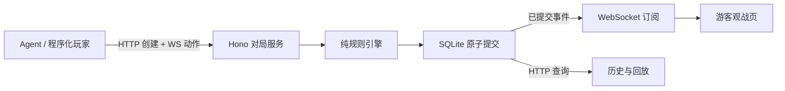

## Context

**定稿范围：** 首版游客纯查看，后续人机共玩；Hono + SQLite + WebSocket；服务端固定节拍持续移动，用于测试快速模型。用户已确认游戏速度可配置。下文给出开局速度、计划 tick 输入截止、断线与重启、延迟记录的完整语义；当前已进入实现，实际完成度见 tasks.md。

动机和范围见 [proposal.md](proposal.md)。实现前检查的基线是 SolidJS + TanStack Solid Start + Vite 模板，首页和 Header 尚为模板内容，没有实际对局引擎、Hono、SQLite、WebSocket 或记录存储。Node 为 v22.22.2，项目使用 npm/package-lock；不为此迁移整个包管理或前端框架。现有 Vercel 配置服务于前端，不能当作独立常驻游戏服务已经具备的部署环境。Biome 配置与依赖版本存在待验证的不一致。

## Goals / Non-Goals

**Goals:**

- 游客免登录查看，服务端独立运行；所有游戏状态、分数、奖励和记录以服务端提交结果为准。
- 实时观战与历史回放消费同一份有序记录，断线后可续读，不重新随机或重新调用 Agent。
- 将控制权限、游戏推进、持久化和展示分离，为后续人机共玩保留清楚边界。

**Non-Goals:**

- 首版不开放自己玩、人类键盘控制、开局、抢占或人机共玩；原实时调速滑块和快捷键后移。
- 接入指定 OpenRouter JEV 1.13，不内置自动寻路策略、账号体系、排行榜、商店或关卡编辑器。
- 用户已授权本轮实现。
- Seedance 视频是可选素材提示词，不进入运行依赖。

## Decisions

### 1. 前后端边界

采用独立 Node 常驻 Hono 服务，使用 `@hono/node-server`，SQLite 驱动选择 `better-sqlite3`，WebSocket 使用 `ws` 与 Hono Node 适配器的升级接口。前端保留 Solid Start，只渲染公开快照和回放。



Hono 官方 Node 文档已提供 WebSocket 接入方式；此次采用这一通道以支持动作、确认和广播的双向通信。SSE 适合单向推送，当前选择 WS 是为了统一后续交互协议；不并行实现两套实时通道或静默切换传输方式。[Hono Node / WebSocket](https://hono.dev/docs/getting-started/nodejs#websocket)

建议目录：

```text
server/
  app.ts                   # Hono 应用，可注入数据库和依赖以测试
  index.ts                 # Node HTTP / WebSocket 启动入口
  game/                    # 引擎、障碍与奖励生成、推进驱动
  matches/                 # 控制服务、只读查询、公开序列化
  realtime/                # 观测/控制连接、消息校验、按 seq 续读
  db/                      # SQLite 连接、迁移与 repositories
shared/snake/              # 公开 DTO、消息和记录版本契约
src/features/snake/
  SnakeBoard.tsx           # SVG 展示，所有模式复用
  SpectatorPage.tsx
  MatchHistoryPage.tsx
  MatchReplayPage.tsx
  replay-clock.ts          # 仅控制观看速度
  snake.css
public/assets/snake/
```

开发前端默认 3000、后端建议 3001，通过 Vite 的 `/api` 与 WS 代理同源连接；生产将这两个路径代理到 Hono，前端应用保持原部署方式。SQLite 文件必须位于后端持久磁盘，通过显式 `SQLITE_PATH` 指定，启动输出实际路径。无法读取、迁移或写入时明确失败，不改用内存库。

### 2. HTTP 查询与 WebSocket 实时协议

HTTP 负责持久资源查询和创建；WS 负责控制与观测。创建请求包含正整数 `tickIntervalMs`，默认 300，随初始局面持久保存；本局开始后不修改间隔。

| 通道 | 入口 | 职责 |
| --- | --- | --- |
| HTTP | `GET /api/health` | 后端及数据库就绪状态 |
| HTTP | `GET /api/matches` | 当前与历史对局摘要、参与者/结果筛选、游标分页 |
| HTTP | `GET /api/matches/:id` | 最新已提交公开局面 |
| HTTP | `GET /api/matches/:id/events?afterSeq=...` | 历史事件、回放和恢复读取 |
| HTTP | `POST /api/matches` | 受保护且可去重的创建请求，返回局标识及初始公开状态 |
| WS | `/ws/matches/:id/watch` | 游客公开只读订阅 |
| WS | `/ws/matches/:id/control` | 验证该局控制凭证后接收 Agent 动作并确认 |

游客连接仅支持 `subscribe { afterSeq }` 等查看消息；收到 start/action/stop 返回只读错误。控制消息包含 `protocolVersion`、`requestId`、`type`；方向消息额外包含 `observedSeq`、`targetTick`、`direction`。确认包含同一 requestId、accepted/rejected/applied/cancelled、相关 seq 与错误码。ready 局在 start 成功后开始计时，连接或重连本身不启动。stop 明确结算为 interrupted，不提供首版暂停或局内调速。

方向请求示例：`{ "protocolVersion": 1, "requestId": "req-19", "type": "action", "observedSeq": 214, "targetTick": 185, "direction": "up" }`。其中 seq 214 是 Agent 观察的本局已提交事件，已完成移动为 tick 184。只有 tick 185 的截止之前才能接纳此方向；ack accepted 后不会提前移动，tick 185 完成后再发送 applied。

公开状态消息包含 `matchId`、`seq`、`tick`、`gameTimeMs`、`tickIntervalMs`、下一 tick 及其计划时间、`eventType`、公开状态快照。显示用的 serverTime/nextTickAt 使用服务器时间，实际截止判定用服务端单调时钟，不能相信客户端本地时间。错误码包括 unauthorized、readonly、invalid_direction、invalid_observation、not_running、match_ended、late_action、stale_state、projection_unavailable、tick_action_conflict、request_id_conflict。未知消息和非法动作明确拒绝，不代为改方向。

### 3. 游客只读权限

HTTP 创建接口校验服务端配置的 `GAME_ADMIN_TOKEN`。获授权的程序化客户端生成高熵随机的该局控制 token，随带唯一 requestId 的创建请求提交；服务端只保存其 hash。相同创建请求重发返回原局标识，客户端不依赖一次性响应取回密钥。后续控制 WS 握手通过 Authorization Bearer 校验目标局凭证。程序化客户端可以设置握手请求头，游客浏览器无需任何控制密钥。

游客页面及公开 API 使用独立的公开 DTO，不能直接序列化内部数据库整行。密钥不进 URL、事件、构建变量或日志；游客即使自行构造 WS 消息也无法越过服务端授权。这个边界是游客纯查看所需的权限校验，后续用户账号与中途接管另行设计。

### 4. SQLite 原子提交与数据表

SQLite 是已提交事实来源，内存只维护连接和可重建的运行状态。初版单个 Hono 实例持有该库，避免为首版引入分布式控制权协调。

| 表 | 关键字段与约束 |
| --- | --- |
| `matches` | id、参与者、规则/记录版本、tick_interval_ms、状态、起止时间、分数/步数/有效时长、latest_seq、最新状态 JSON、完整性、结束原因、control_token_hash |
| `match_events` | match_id + seq 联合主键、tick、game_time_ms、event_type、公开 payload 与实际状态快照 |
| `control_requests` | match_id + request_id 唯一、请求摘要、observed_seq、target_tick、received_game_time_ms、accepted/rejected/applied/cancelled、原因与对应 seq |
| `schema_migrations` | 迁移版本及校验信息 |

创建请求的去重键须另有全局唯一约束，并保存创建内容摘要到相应 match；摘要涉及凭证时只包含其 hash，不保存明文。

采用 WAL 和外键，要求“提交后确认”的数据持久语义时采用 FULL 同步设置。SQLite 允许并发读，但同时只有一个写事务；事务保持短小，不在事务内等待 Agent 或网络。[SQLite transactions](https://sqlite.org/lang_transaction.html)、[SQLite WAL](https://sqlite.org/wal.html)

每次确认变化在一个同步事务中完成：读取并验证当前局面/请求标识 → 计算合法变化 → 写事件 → 更新最新局面与摘要 → 保存请求确认结果 → 提交。提交完成后才更新可见内存状态、发 ack 和广播。失败退出事务并明确暴露错误，不推进未持久化的局面。事务回调不能包含 await；驱动支持异常回滚及 immediate 事务。[better-sqlite3 transaction API](https://github.com/WiseLibs/better-sqlite3/blob/master/docs/api.md#transactionfunction---function)

安装时锁定驱动版本并检查实际 SQLite 版本，避免使用官方已指出存在 WAL-reset 缺陷的旧版本；使用已修复的 SQLite 3.51.3 或更新版本。数据目录和数据库/WAL 备份遵循 SQLite 一致性备份方式，不能在写入中只复制主文件。[SQLite WAL version notes](https://sqlite.org/wal.html#the_wal_reset_bug)

### 5. 重复请求、并发与断线恢复

相同 `requestId` 加相同内容返回原接纳结果与已知生效结果，不能再次占用方向槽或走一步；同标识不同内容返回冲突。先查去重记录，再校验新请求的截止和当前状态，因此成功请求迟到重发仍得到其原结果。

每局按服务端处理顺序串行结算。方向绑定当前实际局面的下一移动 targetTick 和 expectedStateHash；每个 tick 第一个合法请求占用该方向槽，后续不同请求返回明确冲突，不静默覆盖，也不排队到下一 tick。此规则保证一格最多转向一次；未接纳新方向时继续当前方向是正式游戏规则。非法动作不占槽，同 requestId 重发不再占槽。observedSeq 必须是本局存在且不超前的已提交事件；旧观察本身用于衡量局面滞后，是否赶上目标 tick 仍以 targetTick 的截止判断。

WebSocket 是推送渠道，数据库中的事件序列是恢复依据。订阅先建立按 seq 的读取游标，再读取当前已提交上界并发送缺失记录；发送期间新提交的事件通过同一游标继续读取，不采用“先读快照，再无保护订阅”的漏事件流程。通知仅唤醒读取，内容仍按已提交 seq 取得。

前端丢弃已处理的重复 seq，发现缺口立即显示补齐状态并从最后连续 seq 续读，不跨过缺口伪装为实时。服务在提交后、广播前崩溃也不会丢失事件。慢观众显示落后/补齐中，不影响服务端判定；发送等待必须位于数据库事务之外。

控制 WS 断开时游戏继续当前节拍，已接纳方向仍在目标 tick 生效；没有新方向则继续当前方向，可能正常碰撞结束。重连只恢复观察与提交能力，不重开、不暂停。服务进程重新启动时，原 running 局在迁移成功后、开放流量前原子标记 interrupted/server_restart；追加终止事件，将未生效请求记为 cancelled，保留最后已提交有效时间和局面。ready 局不启动，已有终局不变。不补跑进程停机期间的 tick，因为那段时间没有可验证的对局执行。

### 6. 规则与推进模型

玩法保持 24×18、初始蛇长 4、向右、12 个随机固定障碍，苹果 +10 并增长，星星 +30 不增长，每吃 5 个苹果触发且存续 8 秒有效游戏时间。蛇头初始 (7,9)，身体 (6,9)、(5,9)、(4,9)，前方三格保留安全区。

引擎是纯状态转换，输入为显式动作、显式游戏时间与随机源。碰撞、增长、腾出尾格和满盘均在服务器判断。障碍从合法格有限集合洗牌，逐一保留不破坏可用格连通性的格；不做无限随机重试或静默减少障碍。奖励从实际空格抽取；苹果无空格而星星占唯一可用格时让出星星位置。

采用固定节拍持续推进。创建处于 ready；start 成功后建立单调时间锚点，tick n 的计划时刻为 `start + n * tickIntervalMs`，第一步在一个间隔后。例如 125ms 为 8 格/秒，500ms 为 2 格/秒；支持任意合法正整数间隔，不人为限制只有预设档位。首版同一局固定速度，速度变化通过下一局配置实现，原始配置始终写入历史。

有效游戏时间随 running 状态的单调时钟推进，不随 Agent 请求、浏览器 RAF 或网络消息数量推进。下一待处理时刻为下一移动或星星到期中更早者；二者同时发生时先处理到期再移动。单次回调晚到时按计划时间顺序结算所有已到期事件，遇到终局立即停止，不丢 tick、不限制补步数或重置时钟来掩盖变慢；额外记录 `schedulerLagMs`，将服务器调度落后与 Agent 决策迟到区分。

WS 消息处理入口捕获服务端单调时间。判定新动作前，先结算截至该收件时间的所有到期事件；目标时刻 `<= receivedAt` 为迟到，包括恰好同时到达。迟到明确 rejected/late_action，不把目标改成下一步。只允许 targetTick 等于当前 tick + 1，且 observedSeq 对应当前实际 tick；服务端在接纳和执行时验证局面摘要。

方向请求接纳时将 pending 方向与 accepted 记录持久化；此时蛇的位置和实际方向均不变。到目标 tick，结合 pending 方向进行移动/碰撞判定，并在同一事务中写 applied、该步结果、更新局面和摘要。accepted 请求遇到 stop/进程中断则 cancelled。普通协议/规则错误返回明确结果；游戏事件的存储故障或不可恢复引擎错误停止服务端游戏执行并暴露为错误，不以未持久局面继续推进。重启恢复按上一节处理。

为测试快速模型，记录 `observedSeq`、观察事件的有效时间、`targetTick`、截止时间、服务端收件时间、最终 appliedTick/拒绝原因。`observationToReceiveMs` 从同一服务端时间轴计算，包含局面推送、模型处理和返回链路，不能标作纯模型推理耗时；客户端可显式报告可选 `inferenceMs`，标记来源为客户端，不代替服务端时间。记录原始证据和结果，不扩展成模型排行榜或自动评测体系。

### 7. 历史和回放的数据一致性

保存实际快照及结构化事件，不仅保存 seed 和按键。记录版本、规则版本、实际障碍和奖励生成结果都持久化；回放不重新随机、不重新执行 Agent。

`seq` 对每个事件递增，`tick` 只对已结算的移动尝试递增，包含导致碰撞的最后一步，两者不能混用。碰撞时保留合法格位置，在终局事件单独保存尝试方向/目标格，不能画出穿墙位置。启动、方向 accepted/rejected、奖励到期和中断等非移动事件也有独立 seq；它们按事件时间保存当时状态，不能把未来方向提前写入实际方向。回放按有效时间和 seq 定位，带上两步之间事件。播放倍速不修改原局；迟到指令可见但不进入实际轨迹。

历史按开始时间排序，首版按实际 Agent 名称和结果筛选，不提供人类玩家筛选。中断局显示已记录终点及原因，空历史保持真实空状态。没有默认删除旧局、保留局数上限或静默清理策略。

### 8. 展示、格子对齐与流畅度

页面为 `/` 观战、`/matches` 历史、`/matches/$matchId/replay` 回放，首版没有 `/play`。游客无需登录、不能开局或抢占控制权；无进行中对局时显示空状态与历史入口。

视觉使用奶油白 #FFF7E4、黑色 #171717 粗描边、硬阴影、珊瑚红/金黄/薄荷青/淡紫蛇身，保留生成的苹果与星星。棋盘采用 SVG，统一 `viewBox="0 0 768 576"`，格宽 32，物件位置 `(x*32,y*32)`，格中心 `(16,16)`，整体等比缩放。桌面为棋盘加侧栏，窄屏堆叠。

WS 到达频率不等于画面刷新率。客户端只在连续已确认状态之间按移动路径插值：转弯沿正交路径，增长的尾部不凭空移动，跳转回放和序列缺口直接定位，不能预测未收到的下一步。视觉允许略滞后于权威 tick，UI 应显示同步状态。减少动态效果时取消装饰动画，仍显示真实状态。

吃奖励的短促缩放和分数提示只由真实事件触发，不能改变格坐标或碰撞。Agent 未提供的说明不编造。相对 Canvas，当前 SVG 足够支撑格状棋盘，且与精确布局和资源缩放直接对应。

`preview/index.html`、`history.html`、`replay.html` 是静态规划附件，带清晰示例标识；原 ImageGen 整页图及旧预览仅作美术参考。此前 ego-browser 空间已由用户接管，本次没有绕过该控制权限制，更新预览需区分文件检查与未完成的浏览器渲染复查。

### 9. 验证

后端用真实临时 SQLite 文件、可控时间和确定性随机序列验证规则、事务失败、重启读取、重复动作与控制权限；WS 使用真实连接验证匿名写入拒绝、断线续读及提交后广播中断。不能用内存假仓库代替持久化验收。

前端检查免登录查看、空状态、历史筛选、回放步进/倍速、观战断线、Tab 焦点、1440px/375px 布局和减少动态效果。服务端及前端分别做类型检查、构建和相关 Biome 检查；发现既有配置问题要定位并最小修复，不静默跳过。

## Risks / Trade-offs

- [模型“秒出”仍可能慢于一格间隔] → 当前默认间隔 300ms，模型必须在当前移动窗口内完成；开局可配置间隔，记录端到端耗时与实际迟到，不能为了等待模型而偷偷暂停游戏。
- [SQLite 同时仅一个写事务] → 单实例、短事务，实际负载测量后再谈扩展，不引入 Redis 或分布式锁。
- [原生 SQLite 驱动部署要求] → 验证目标 Node 平台安装及实际 SQLite 版本，锁定依赖，后端部署到具有持久磁盘的环境。
- [WS 重连与插值可能造成错觉] → 用连续 seq 与真实事件恢复，断线明确标识，禁止未确认状态预测。
- [生成图格子不准] → 运行和新版预览统一格坐标，图像仅提供奖励美术。
- [未来人机共玩扩大权限模型] → 首版仅划清游客读取与控制者写入，不提前实现登录、匹配或中途接管。

## Migration Plan

1. 按固定节拍、计划 tick 截止、可配置开局间隔与中断恢复契约建立后端测试。
2. 建立独立 Hono 服务、版本化迁移和持久目录，接入真实程序化玩家控制入口。
3. 接入前端只读查询/WS 与历史回放，移除模板导航干扰。
4. 完成规则、事务、WS、重启与浏览器验收；数据迁移失败不得启动空库。
5. 回滚代码不删除既有历史，先备份，按记录/schema 兼容性决定可读取范围。

## Implementation refinement

用户明确修正为当前步实时决策：GET /api/matches/:id/decision-context 返回真实已提交局面，targetTick 固定为当前 tick + 1。服务端拒绝未来目标或旧观察改绑；runner 在结果接纳后等待真正移动，不在同一窗口反复询问，不预测后续位置。位置或奖励变化导致摘要不符则取消，迟到结果明确拒绝。旧预判逻辑已移除，旧回放仍按已存快照显示并标记预判正文。

默认 provider 为 Typesafe，POST https://api.typesafe.ai/v1/systemone，使用独立 TYPESAFE_API_KEY，模型固定 jev-1.13.0。JEV_PROVIDER=openrouter 时显式使用其独立密钥和端点，不自动切换或重试过期动作。请求正文、实际响应模型和 provider 随决策保存。HTTP 错误、非法方向与无法解析的字段明确报错；概率合计不为 1 只作诊断，不阻断有效方向，且不自动归一化或改选方向。

顶部导航在根布局中只挂载一次，固定为观战与历史对局。首页精确匹配；历史及其回放子路由由路由 active 状态统一激活历史入口。

## Later scope

人机共玩、游客开局、接管和局内调速留待后续。首版只有游客查看与受保护的程序化控制入口。

实现记录：requestMs 是客户端测得的 OpenRouter HTTP 往返时间；inferenceMs 仅在客户端另外提供时表示其报告值。实际接口的 timing 元数据由服务端附加 serverTime、nextTick、nextTickAt，游戏截止仍使用单调时钟。Nitro 开发中间件先于 Vite HTTP 代理，因此 /api/** 使用 Nitro devProxy；WS 仍经 Vite upgrade 代理。
