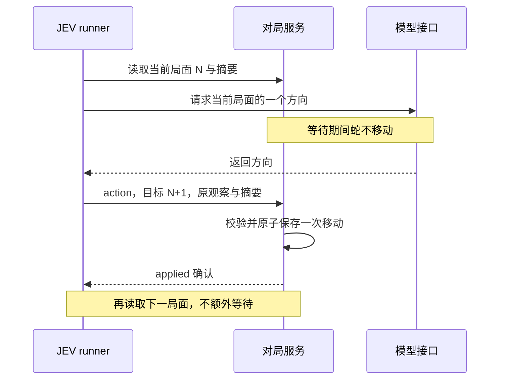

## Context

动机与范围见 [proposal.md](proposal.md)。实施前的代码基线只有固定步频：`MatchService.schedule/advance` 按 `tickIntervalMs` 推进，`validateAction` 按计划时刻拒绝迟到动作，runner 提交后等待 `movedAfter`。模型请求、HTTP/WS 和 SQLite 提交已经分离，可以复用。用户已通过 `openspec-apply-change` 授权本变更实施，实际进度与验收以 tasks.md 和 validation.md 为准。

需要调整的固定间隔假设已定位：共享配置和模型输入要求数值 `tickIntervalMs`；计时接口返回固定截止；棋盘插值使用间隔的 0.8 倍；观战、历史和回放用 `1000 / tickIntervalMs` 显示速度。回放本身已按事件 `gameTimeMs` 定位，可保留其时间轴。

数据库将局面与事件保存为 JSON，实施时已有单步 v1 与两步 v2 记录。主规格目录为空，已有能力基线在未归档的 `add-neobrutalist-snake/specs/`。实施开始时，`add-two-step-decision-fallback` 的代码已经完成；本变更保留固定模式的两步功能，并使用新版本 v3。

## Goals / Non-Goals

**Goals:**

- 新增一次有效响应立即走一步的模式，保留当前固定模式及既有历史。
- 等待、拒绝、断线、重复请求均不会导致额外移动；所有成功变化仍先持久化再确认。
- 展示与回放真实的非等间隔过程。

**Non-Goals:**

- 不改变服务商、增强 context、碰撞规则或游客权限。
- 不增加自动寻路、备用方向、并行模型请求、隐式重试、最低步间隔或 FPS 限制。
- 不改写其他 change，不改变固定模式的两步策略。

## Decisions

### 1. 显式模式，固定模式保持默认

新增 `--step-mode fixed|response`、环境变量 `SNAKE_STEP_MODE` 和对应的开局配置。CLI 优先于环境变量，均省略时仍为 fixed；仅 fixed 使用 `tickIntervalMs`。response 的规范化配置明确使用 `tickIntervalMs: null`，显式同时传入 `--tick-ms` 在创建前报错；固定模式专用的 `SNAKE_TICK_MS` 环境默认值不导入 response。

fixed 运行器保留默认 `two_step_fallback`；response 未显式选择决策策略时使用 `single_step`，显式选择 `two_step_fallback` 则在创建前报错。共享创建接口对未传 decisionMode 的旧 fixed 客户端继续保留原单步语义。

不使用步长 0 或无限大模拟响应模式，否则会产生定时器空转、假截止和错误的速度显示。模式在创建时确定，不能中途切换。

### 2. 服务端立即应用，客户端串行闭环

`schedule/advance` 在 response 下只处理奖励到期，不安排移动定时器。running 状态仍保留单调时钟锚点，即使当前没有待执行计时器。

收到 response 动作时，先处理截至收件时刻的到期事件，再校验目标恰为当前 tick + 1、观察位置和摘要。有效动作直接调用现有移动规则；碰撞也计为一次移动尝试。请求、accepted 事件、移动/终局事件、最新局面和 applied 回执在一次事务中提交，pending 不存后续动作。accepted 与移动可同时间、不同 seq；对外成功确认在提交之后。

复用现有请求 ID 去重。旧请求重发返回原结果，不再走一步；不同请求抢同一观察位置，先提交者生效，后者明确失效。网络/API/解析失败保持现有显式中断策略。非法反向或奖励变化导致的拒绝不移动，runner 重新读取局面后可再次询问；协议、鉴权和错误目标等程序错误不静默循环重试。

固定模式继续使用已有截止与定时应用逻辑。response 没有按耗时判定的 `late_action`，但仍拒绝旧位置、错误目标和失效摘要。

### 3. 时间是实测值，不是配置步长

两种模式的运行时间均包含模型等待。星星沿用现有真实时间 8 秒有效期；到期与动作同时发生时先过期。此项保留既有行为，用户若另选暂停计时，需要同步调整相关规格与测试。

决策上下文的 `deadlineInMs`、公开计时的 `nextTickAt` 在 response 下为 null；`nextTick` 仍是下一移动编号。新增明确的模式标识，以及服务端当前 `elapsedGameTimeMs`，与事件中最后已提交的 `gameTimeMs` 区分。请求正文包含模式和观察时刻，不伪造固定截止。

每次移动保存实际时间，事件保存距上次移动的 `stepDurationMs`，状态中的 `lastStepDurationMs` 保留最近一步间隔；第一步从 start 计算。`requestMs` 继续表示客户端请求耗时，不能等同于步间隔或纯推理耗时。零步或同时间戳样本显示无可计算步频，不制造时间差。

观战时间可从服务端时间基准做仅用于显示的递增，蛇和分数只随已提交事件变化。受控停止保存当时真实已运行时间；异常进程退出只能保留最后持久化时刻，不把停机等待补成已运行时间。

### 4. 保留旧格式，明确识别新记录

既有 v1 固定记录原文不变，缺少模式字段时按已知的固定语义读取。新增 response 记录使用 `recordVersion: 3`、`rulesVersion: 3`，显式保存模式、空固定间隔和真实步间隔；固定模式继续兼容单步 v1 与两步 v2。

更新 `Store.decode/events` 与前端 `assertRecord` 的版本分支，未知版本仍明确失败。不向旧 JSON 注入默认字段后重新计算旧创建请求摘要或状态摘要，避免升级后相同请求被误判冲突。SQLite 现有 JSON 表足够承载，预计无需改物理表结构。

控制消息仍使用 `protocolVersion: 1` 的现有单步信封，按已保存的模式决定定时接纳或即刻应用；固定两步继续使用控制协议 v2。记录版本和控制协议版本分开：记录版本 2 已由固定模式的两步记录使用，因此响应记录使用版本 3，三个记录版本分别读取，不复用不兼容格式。

### 5. 展示和回放

- 观战、历史、决策输入及回放明确标注“固定步频”或“随模型响应”。response 不显示虚构的配置速度，可显示已记录平均步频和最近一步间隔。
- 无动作时显示“等待下一次决策后移动”，不声称知道模型内部状态；与 WebSocket 断线提示分开。
- response 首版直接显示每个最新确认位置，不拿上次间隔预测下一步，不等待动画完成才处理后续状态。得分反馈与移动插值解耦。
- 回放仍以 `gameTimeMs`、seq 和原始快照为依据，保留长等待与短间隔；倍速只缩放原始时间差，同时间戳按 seq 处理。

### 6. 与已实现两步备用功能的边界

`add-two-step-decision-fallback` 已实现固定模式两步备用，本次不扩展该功能。response 使用 single_step，一次调用只执行一步，不消费备用计划；显式 `response + two_step_fallback` 必须在创建前报不兼容，不能连续走两格。fixed 继续支持既有单步和两步策略。

## Risks / Trade-offs

- 接口挂起会让蛇长期不动 → 这是所选模式的语义，明确展示等待，保留主动停止，不添加未授权的超时替代方向。
- 星星在等待中到期会使响应失效 → 记录拒绝并重新请求当前局面，不吃过期奖励。
- 快模型会增加请求量 → 不隐藏限速或自动降速；上游错误真实暴露，性能统计包含必要提交开销。
- 旧记录摘要或创建去重被默认字段改变 → 版本分支读取，旧数据与摘要输入保持原样，专门回归旧请求重发。
- 快速事件超过屏幕刷新率 → 服务端完整保存，界面显示最新确认状态，回放可逐步核对，不让渲染速度影响规则。

## Migration Plan

1. 先加入 v1/v2/v3 三种记录版本的兼容读取与模式契约，再启用 response 创建和运行。
2. 保留 fixed 默认及原测试；补充 response 的时钟、事务、runner、WS 和回放测试。
3. 更新前端模式展示、README 和环境说明，完成两种模式并存的真实验收。
4. 回滚前保留数据库；旧代码不能读取 v3 时明确报错，不删除新记录或将其改写成固定模式。
